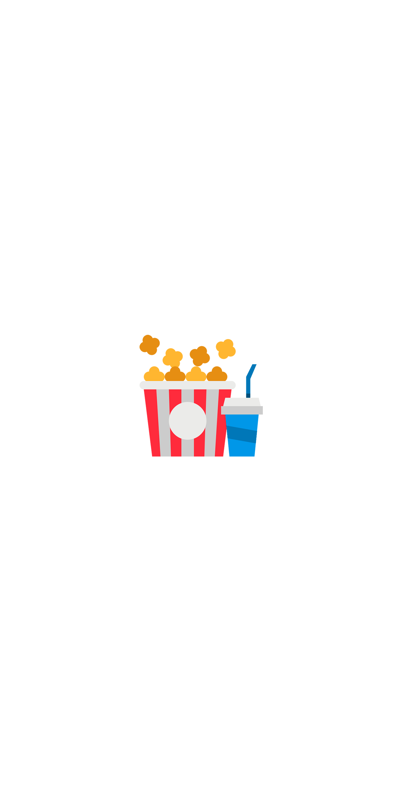

<h1 align="center">dev-cinemapp</h1>
<h3 align="center">Bem-vindx ao mundo espetacular do cinema. Nesse projeto, desenvolvido em React Native com expo, o usuário pode buscar por seus filmes prediletos e favorita-los</h3>

<h3 align="center" >Tabela de Conteúdos </h3>

 • <a href="#uso">Como usar</a>
 • <a href="#premissas">Premissas</a>
 • <a href="#aplicacao">Aplicativo</a>
 • <a href="#autor">Autor</a>

<h3 id="#uso">Como usar</h3>

Para utilizar esse projeto primeiro clone esse repositório em sua máquina local, entre na pasta do projeto e use o comando <strong>yarn</strong> para 
instalar as dependências do projeto

Para executar o projeto, use o comando <strong>expo start</strong> dentro da pasta do projeto, é importante que você tenha o expo instalado de forma 
global em sua máquina. Para visualizar o aplicativo é necessário ter um emulador do Android ou IOS, ou em seu dispositivo movel ter o app Expo Go instalado.

Para usar o Expo Go, após executar o projeto com o comando "expo start" uma aba do navegador será aberta com um QR Code, leia o QR code pela camerâ do 
seu celular. Após ler o QR Code você será redirecionado para o app Expo Go e o projeto será executado.

<h3 id="premissas">Premissas</h3>

Aqui, irei falar sobre meu processo de desenvolvimento dessa aplicação.

Bom, ao receber o desafio logo analisei as proposições e li a documentação da api que seria utilizada para fornecer os dados. Optei por desenvolver o 
projeto com o React Native pois era a ferramenta pela qual eu tinha a maior familiaridade. 
Criei o projeto com o auxilio da ferramenta Expo, tomei essa decisão com objetivo de ganhar em eficiência visto que ao usar o Expo podemos pular toda parte de
configuração de ambiente android ou IOS em nossa máquina. Também seria possível visualizar as alterações realizadas no app, com maior velocidade, atráves do Expo rodando
no dispositivo fisico.

Meu próximo passo foi criar uma pasta e rodar o comando para criação da estrutura do projeto expo. Defini a estrutura de pastas que seria utilizada 
bem como instalei as dependências que sabia que iria precisar.

Meu próximo passo foi a criação das telas e componentes do app, tomei a decisão de primeiro desenvolver as telas e só depois fazer a integração com a api que forneceria os dados.

Após finalizar as telas, meu próximo objetivo foi voltar a ler a documentação da API dos filmes. Criei um contexto na aplicação para partilhar os dados da api com todas as telas
e criei um storage para armazenar os filmes favoritos.

Enfim, tomei a decisão de começar o projeto por onde já conhecia, ou seja da parte que era mais familiar para mim. Dessa forma, conforme fui escrevendo as linhas
de código simultaneamente ganhava mais confiança. O propósito dessa decisão foi chegar nas partes mais complexas do projeto com a confiança acumulada ao ter visto toda a parte
que eu já sabia desenvolver funcionando em perfeito estado

<h3 id="#aplicacao">Aplicativo</h3>

